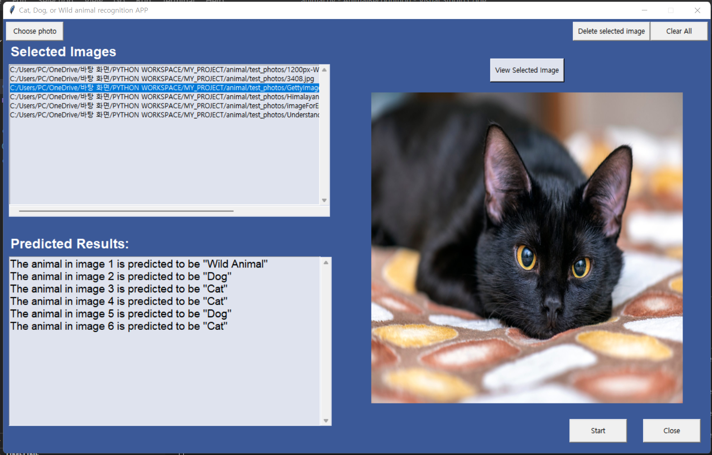

# Animal Recognition

This is an animal recognition application that predicts whether the animal in a given photo is a cat, dog, or a wild animal.  

  

In order to train the model, the dataset from kaggle was used.  
Here is the link:  
Animal faces: https://www.kaggle.com/andrewmvd/animal-faces  

For the model training, the pre-trained model of VGG16 was used for the classification of different animals. Instead of classifying 1000 categories which was originally trained, only 3 categories were choosed for classification:  
- Cat  
- Dog  
- Wild animal.  

Fine tuning with Tensorflow's Keras API was used on this pre-trained model to build a neural network for the specified classification. As the original VGG16 model trained on cat and dog classes, after training this model to newly categorized classes with epochs of 5, the validation accuracy went up to 99.56% for classifying numeous given images to these 3 classes.  

## File informations:  
- zip_images.zip file contains images that were used for the training model. Originally, I used 3000 images for training and 900 images for validation. However, due to file size restriction on github, the zip_images folder include 1500 training images and 300 images for validation, which still works very well with training of 5 epochs.  
- train_model.py file contains the code that actually builds a model through the training process and validates the model with given images.  
- predict.py file contains the function that predicts the animal classes when images are given as input.  
- animal.py file contains the codes that visualize the app through GUI of Tkinter.  
 

To start the web application, run:
### `python animal.py` or `python3 animal.py`

## Important functions and notes:  
1. First, unzip the "zip_images.zip" folder.  
2. Run the "train_model.py" codes to train, validate, and generate the model to use for the prediction.  
3. Start the application, and click on "Choose Image" button to upload photos that you want the application to predict.  
	- Click on "Delete selected image" to delete images that you selected from the screen.  
	- Click on "Start" button to predict the classes of the animals in the uploaded photos. This process might take few seconds. 
	- Click on "Clear All" button to clear all the texts and informations on the screen.  
	- Click on "Close" button the finish the application.